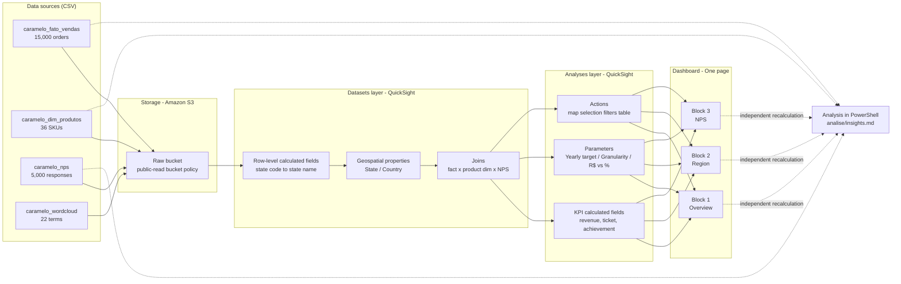
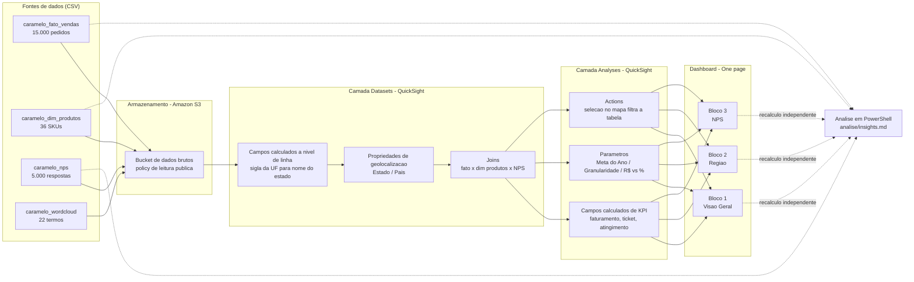

<details name="lang-toggle">
<summary><b>🇺🇸 English</b></summary>

# 🐾 Petshop Center Executive Dashboard — One Page: Results and Customer Satisfaction


##


📄 **[Full dashboard as PDF](midia/dashboard-one-page.pdf)** · 🎬 **[Screen recording (MP4)](midia/dashboard-passeio.mp4)** · 📊 **[Analysis and business insights](analise/insights.md)**

> The QuickSight subscription has been terminated, so the live dashboard is no longer reachable.
> The recording above and the PDF preserve the result and the interactivity of the panel.

## 🎯 Business problem

**Caramelo Pet Center** — an omnichannel chain with 150+ stores, a retail/clinic/grooming ecosystem, and 2+ million active customers — faces a "lots of data, few insights" scenario, marked by diverging numbers, report overload with no single source of truth, and no connection between macro indicators and root cause.

**Goal:** build a one page report gathering, on a single screen, the main sales/results and customer satisfaction indicators, giving the board a reliable and integrated view of the business.

The panel is split into three blocks:

### Block 1 — Overview
- Big numbers for revenue, average ticket, and target achievement.
- Editable target (currently R$ 4M, recalculated monthly by the finance team).
- Pie chart of revenue by product category.
- Monthly revenue evolution: absolute value (R$) and 100% stacked bar by category.
- Line chart with the average ticket evolution.

### Block 2 — Performance by Region
- Revenue map by state, highlighting the best performing states.
- Interactivity: selecting a state must filter the table next to it.
- Table of quantity sold and revenue by animal type (dog, cat, rabbit, etc.) per state.

### Block 3 — Customer Satisfaction (NPS)
- Word cloud with the main compliments and complaints from comments.
- Pie chart with the distribution of promoters, passives, and detractors.
- Total respondents and average score indicators.
- Filter by customer classification (e.g. isolate detractors and see their most frequent words).

### Key requirements
- Consolidate multiple sources into a single source of truth.
- Ensure editable parameters (target).
- Interactivity between visuals (state selection → table; classification filter → word cloud).

## 🏗️ Architecture / Data flow



## ⚙️ Execution phases

### 1. Ingestion — Storage on Amazon S3
The raw source files were uploaded to **Amazon S3**, which acts as the project's storage layer. The connection to S3 is made in the QuickSight **Datasets** tab, where the files are imported and connected as data sources. The bucket policy used is versioned in `configuracoes-aws/s3_bucket_policy.json`.

### 2. Transformation — Datasets layer
Still in the *Datasets* layer, the following were applied:
- **Row-level calculated fields** (non-aggregated), which return the information on each record without affecting the granularity of later analyses — e.g. converting the state code into the full state name (`campos-calculados/campo_estado_calculado.txt`).
- **Geospatial properties**, assigning the correct geographic type to fields such as state name and country name, enabling the map visuals.
- **Joins between tables**, crossing information from different sources to compose the strategic views.

### 3. Analysis layer — Analyses
The *analyses* consume multiple *datasets* and concentrate the analytical modeling. In this layer were created:
- **Calculated fields** to build the main indicators (KPIs) and the remaining blocks.
- **Parameters** with two roles: giving agility to the interface and feeding filters that customize the visualization and steer the analyses, making the experience more dynamic and directed.
- **Actions and settings** to add interactivity between visuals and enrich the visualization experience.
- A **custom visual in Highcharts** for the NPS block (`visuais-customizados/`), adapted from the official `variablepie` example to display response volume against average score.

### 4. Publication — Dashboard deploy
Finally, the dashboard *deploy* closes the flow, delivering the consolidated view on a single screen — the *one page* of results and customer satisfaction.

### 5. Independent validation
The indicators were recalculated straight from the CSVs with PowerShell, without going through QuickSight, to validate the panel and produce the business insights — see `analise/`.

## 🛠️ Tech stack and rationale

| Layer | Technology | Why |
|---|---|---|
| Storage | **Amazon S3** | Raw file storage, native source for QuickSight |
| BI / Dashboard | **AWS QuickSight** | Datasets, analyses, parameters, and actions in a single managed service |
| Custom visual | **Highcharts** (`variablepie`) | NPS chart with volume and average score in the same mark |
| Independent analysis | **PowerShell** (`Import-Csv`) | Recalculating metrics from the CSVs with no external dependency |
| Documentation | Markdown + Mermaid | Versioned architecture and insights |

## 💻 Reproducing the analysis

The numbers in `analise/insights.md` are generated by scripts that read the CSVs in `dados/` directly:

```powershell
git clone https://github.com/MichaelJourdain93/dashboard-executivo-petshop-center.git
cd dashboard-executivo-petshop-center

./analise/analise.ps1     # metrics for the three blocks
./analise/verifica.ps1    # integrity checks and average ticket definition
```

No installation required — only PowerShell, already present on Windows.

## 📈 Results / Insights

Full analysis in **[`analise/insights.md`](analise/insights.md)**. Headline figures for 2025: **R$ 3,282,372.74** in revenue (82.06% of the R$ 4M target), **27.39%** contribution margin, and **5,000 NPS responses** averaging **4.94**.

- **Revenue and profit point in opposite directions.** Pet Food and Pharmacy are 61.3% of revenue but only 41.3% of margin (18.4% vs. 41.5% for the other categories). The four "small" categories — Accessories, Toys, Hygiene, and Food — already generate **58.7% of total margin**. A panel that ranks by revenue alone steers investment the wrong way.
- **December's 11.27% drop in average ticket is a false alarm.** The panel computes ticket as revenue ÷ items; per order, December rose **32.6%** (R$ 208.52 → R$ 276.50). The basket went from 2.0 to 2.98 items per order — December was the best month of the year in both revenue and margin, yet it is flagged in red.
- **Two thirds of the survey sits in the detractor band.** Of 5,000 responses, 64.2% score 0–6 (average 2.97), 18.3% score 7–8 (7.49) and 17.5% score 9–10 (9.49). The overall average is 4.94.
- **Espírito Santo has 330 NPS responses and zero sales** — the state does not exist in the fact table. On the map it renders blank, visually indistinguishable from "sold little".
- **Regional concentration:** Southeast holds 45.4% of revenue, and SP/MG/RJ alone account for 45.3%. Margin is homogeneous across regions (27.1% to 27.8%), so the regional gap is about volume, not profitability.
- **Methodological caveat:** the survey scores are distributed almost uniformly across 0–10 (8.6% to 9.7% per score). That is why every cut of Block 3 comes out flat — average scores per reason (4.78 to 5.17) and per state (4.53 to 5.12) all orbit the midpoint of the scale — so the analysis describes volume and score without ranking reasons or states. The **sales** base, in contrast, has real and consistent structure, which is what sustains the Block 1 and 2 conclusions.

## 📁 Project structure

```
dashboard-executivo-petshop-center/
├── README.md
├── analise/                          # Data analysis and business insights
│   ├── insights.md                       # Answers to the challenge questions
│   ├── analise.ps1                       # Metrics for the three blocks (reproducible)
│   └── verifica.ps1                      # Integrity checks and definitions
├── dados/                            # Raw data sources (CSV) loaded into Amazon S3
│   ├── caramelo_fato_vendas.csv          # Sales fact table
│   ├── caramelo_dim_produtos.csv         # Product dimension
│   ├── caramelo_nps.csv                  # NPS survey responses
│   └── caramelo_wordcloud.csv            # Terms for the word cloud
├── campos-calculados/                # QuickSight calculated field expressions
│   └── campo_estado_calculado.txt        # State code to state name (geolocation/map)
├── visuais-customizados/             # Custom visual code (Highcharts)
│   ├── nps_variablepie_original.js       # Base example from the Highcharts docs
│   └── nps_variablepie_ajustado.json     # Version adapted to NPS (volume vs. quality)
├── configuracoes-aws/                # AWS infrastructure settings
│   └── s3_bucket_policy.json             # Public-read bucket policy for the objects
├── imagens/                          # Images used in the dashboard
│   ├── cachorro.png
│   ├── gato.png
│   ├── coelho.png
│   ├── passaro.png
│   ├── porquinho.png
│   └── pet.jpg
└── midia/                            # Visual record of the dashboard
    ├── dashboard-one-page.pdf            # PDF export of the full one page
    ├── dashboard-passeio.mp4             # Screen recording of the dashboard in use
    └── gifs/
        └── dashboard-passeio.gif         # Same recording, rendered in the README
```

</details>

<details open name="lang-toggle">
<summary><b>🇧🇷 Português</b></summary>

# 🐾 Dashboard Executivo Petshop Center — One Page: Resultados e Satisfação do Cliente


##


📄 **[Dashboard completo em PDF](midia/dashboard-one-page.pdf)** · 🎬 **[Gravação de tela (MP4)](midia/dashboard-passeio.mp4)** · 📊 **[Análise e insights de negócio](analise/insights.md)**

> A assinatura do QuickSight foi encerrada, então o dashboard ao vivo não está mais acessível.
> A gravação acima e o PDF preservam o resultado e a interatividade do painel.

## 🎯 Problema de negócio

A **Caramelo Pet Center** — rede omnichannel com +150 lojas, ecossistema de varejo, clínicas e estética, e +2 milhões de clientes ativos — enfrenta um cenário de "muitos dados, poucos insights", marcado por divergência de números, sobrecarga de relatórios sem fonte oficial da verdade e falta de conexão entre indicadores macro e causa raiz.

**Objetivo:** construir um relatório one page que reúna, em uma única tela, os principais indicadores de vendas/resultados e satisfação do cliente, dando à diretoria uma visão confiável e integrada do negócio.

O painel é dividido em três blocos:

### Bloco 1 — Visão Geral
- Big numbers de faturamento, ticket médio e atingimento de meta.
- Meta editável (atualmente R$ 4 mi, recalculada mensalmente pelo financeiro).
- Gráfico de pizza com faturamento por categoria de produto.
- Evolução mensal do faturamento: valor absoluto (R$) e barra 100% por categoria.
- Gráfico de linhas com a evolução do ticket médio.

### Bloco 2 — Performance por Região
- Mapa de faturamento por estado, destacando estados de melhor performance.
- Interatividade: ao selecionar um estado, a tabela ao lado deve refletir o filtro.
- Tabela de quantidade vendida e faturamento por tipo de animal (cão, gato, coelho etc.) por estado.

### Bloco 3 — Satisfação do Cliente (NPS)
- Nuvem de palavras com principais elogios e reclamações dos comentários.
- Gráfico de pizza com distribuição de promotores, neutros e detratores.
- Indicadores de total de respondentes e nota média.
- Filtro por classificação do cliente (ex.: isolar detratores e ver suas palavras mais frequentes).

### Requisitos-chave
- Consolidar múltiplas fontes em uma única fonte da verdade.
- Garantir parâmetros editáveis (meta).
- Interatividade entre visuais (seleção de estado → tabela; filtro de classificação → nuvem de palavras).

## 🏗️ Arquitetura / Fluxo de dados



## ⚙️ Fases de execução

### 1. Ingestão — Armazenamento no Amazon S3
Os arquivos brutos das fontes de dados foram carregados no **Amazon S3**, que atua como camada de storage do projeto. A conexão com o S3 é feita na aba *Datasets* do QuickSight, onde os arquivos são importados e conectados como fontes de dados. A bucket policy utilizada está versionada em `configuracoes-aws/s3_bucket_policy.json`.

### 2. Transformação — Camada de Datasets
Ainda na camada de *Datasets*, foram aplicados:
- **Campos calculados a nível de linha** (não agregados), que retornam a informação em cada registro sem afetar a granularidade das análises feitas depois — por exemplo, a conversão da sigla da UF no nome completo do estado (`campos-calculados/campo_estado_calculado.txt`).
- **Propriedades de geolocalização**, atribuindo o tipo geográfico correto a campos como nome de estado e nome de país, habilitando os visuais de mapa.
- **Joins entre tabelas**, cruzando informações de diferentes fontes para compor as visões estratégicas.

### 3. Camada de Análise — Analyses
As *analyses* consomem múltiplos *datasets* e concentram a modelagem analítica. Nesta camada foram criados:
- **Campos calculados** para construir os indicadores principais (KPIs) e os demais blocos.
- **Parâmetros** com dois papéis: dar agilidade à interface e alimentar filtros que personalizam a visualização e orientam as análises, deixando a experiência mais dinâmica e direcionada.
- **Actions e configurações** para adicionar interatividade entre os visuais e enriquecer a experiência de visualização.
- Um **visual customizado em Highcharts** para o bloco de NPS (`visuais-customizados/`), adaptado do exemplo oficial `variablepie` para exibir volume de respostas contra nota média.

### 4. Publicação — Deploy do Dashboard
Por fim, o *deploy* do dashboard fecha o fluxo, entregando a visão consolidada em uma única tela — o *one page* de resultados e satisfação do cliente.

### 5. Validação independente
Os indicadores foram recalculados direto dos CSVs em PowerShell, sem passar pelo QuickSight, para validar o painel e gerar os insights de negócio — ver `analise/`.

## 🛠️ Stack técnica e por quê

| Camada | Tecnologia | Por quê |
|---|---|---|
| Armazenamento | **Amazon S3** | Storage dos arquivos brutos, fonte nativa para o QuickSight |
| BI / Dashboard | **AWS QuickSight** | Datasets, analyses, parâmetros e actions em um único serviço gerenciado |
| Visual customizado | **Highcharts** (`variablepie`) | Gráfico de NPS com volume e nota média na mesma marca |
| Análise independente | **PowerShell** (`Import-Csv`) | Recálculo das métricas a partir dos CSVs sem dependência externa |
| Documentação | Markdown + Mermaid | Arquitetura e insights versionados |

## 💻 Como reproduzir a análise

Os números de `analise/insights.md` são gerados por scripts que leem diretamente os CSVs de `dados/`:

```powershell
git clone https://github.com/MichaelJourdain93/dashboard-executivo-petshop-center.git
cd dashboard-executivo-petshop-center

./analise/analise.ps1     # métricas dos três blocos
./analise/verifica.ps1    # checagens de integridade e definição de ticket médio
```

Não requer instalação — apenas o PowerShell, já presente no Windows.

## 📈 Resultados / Insights

Análise completa em **[`analise/insights.md`](analise/insights.md)**. Números de 2025: **R$ 3.282.372,74** de faturamento (82,06% da meta de R$ 4 mi), margem de contribuição de **27,39%** e **5.000 respostas de NPS** com nota média **4,94**.

- **Faturamento e lucro apontam para lados opostos.** Ração e Farmácia são 61,3% do faturamento mas apenas 41,3% da margem (18,4% contra 41,5% das demais categorias). As quatro categorias "pequenas" — Acessórios, Brinquedos, Higiene e Alimentação — já geram **58,7% da margem total**. Um painel que ranqueia só por faturamento leva o investimento para o lado errado.
- **A queda de 11,27% no ticket médio de dezembro é um falso alarme.** O painel calcula ticket como faturamento ÷ itens; por pedido, dezembro subiu **32,6%** (R$ 208,52 → R$ 276,50). A cesta passou de 2,0 para 2,98 itens por pedido — dezembro foi o melhor mês do ano em faturamento *e* em margem, e mesmo assim aparece sinalizado em vermelho.
- **Dois terços da pesquisa estão na faixa de detrator.** Das 5.000 respostas, 64,2% dão nota 0–6 (média 2,97), 18,3% dão 7–8 (7,49) e 17,5% dão 9–10 (9,49). A nota média geral é 4,94.
- **Espírito Santo tem 330 respostas de NPS e zero vendas** — o estado não existe na tabela fato. No mapa ele fica em branco, visualmente indistinguível de "vendeu pouco".
- **Concentração regional:** o Sudeste responde por 45,4% do faturamento, e SP/MG/RJ sozinhos somam 45,3%. A margem é homogênea entre regiões (27,1% a 27,8%), então a diferença regional é de volume, não de rentabilidade.
- **Ressalva metodológica:** as notas da pesquisa estão distribuídas de forma quase uniforme entre 0 e 10 (8,6% a 9,7% por nota). É por isso que todos os cortes do bloco 3 saem parecidos — as notas médias por motivo (4,78 a 5,17) e por estado (4,53 a 5,12) orbitam o meio da escala — então a análise se limita a descrever volume e nota, sem ranquear motivos ou estados. A base de **vendas**, ao contrário, tem estrutura real e consistente, e é ela que sustenta as conclusões dos blocos 1 e 2.

## 📁 Estrutura do projeto

```
dashboard-executivo-petshop-center/
├── README.md
├── analise/                          # Análise dos dados e insights de negócio
│   ├── insights.md                       # Respostas às perguntas do desafio
│   ├── analise.ps1                       # Métricas dos três blocos (reprodutível)
│   └── verifica.ps1                      # Checagens de integridade e definições
├── dados/                            # Fontes de dados brutas (CSV) carregadas no Amazon S3
│   ├── caramelo_fato_vendas.csv          # Tabela fato de vendas
│   ├── caramelo_dim_produtos.csv         # Dimensão de produtos
│   ├── caramelo_nps.csv                  # Respostas da pesquisa de NPS
│   └── caramelo_wordcloud.csv            # Termos para a nuvem de palavras
├── campos-calculados/                # Expressões de campos calculados do QuickSight
│   └── campo_estado_calculado.txt        # Sigla da UF → nome do estado (geolocalização/mapa)
├── visuais-customizados/             # Código dos visuais customizados (Highcharts)
│   ├── nps_variablepie_original.js       # Exemplo base da documentação Highcharts
│   └── nps_variablepie_ajustado.json     # Versão adaptada ao NPS (volume vs. qualidade)
├── configuracoes-aws/                # Configurações de infraestrutura AWS
│   └── s3_bucket_policy.json             # Bucket policy de leitura pública dos objetos
├── imagens/                          # Imagens usadas no dashboard
│   ├── cachorro.png
│   ├── gato.png
│   ├── coelho.png
│   ├── passaro.png
│   ├── porquinho.png
│   └── pet.jpg
└── midia/                            # Registro visual do dashboard
    ├── dashboard-one-page.pdf            # Export em PDF do one page completo
    ├── dashboard-passeio.mp4             # Gravação de tela do dashboard em uso
    └── gifs/
        └── dashboard-passeio.gif         # Mesma gravação, exibida no README
```

</details>
